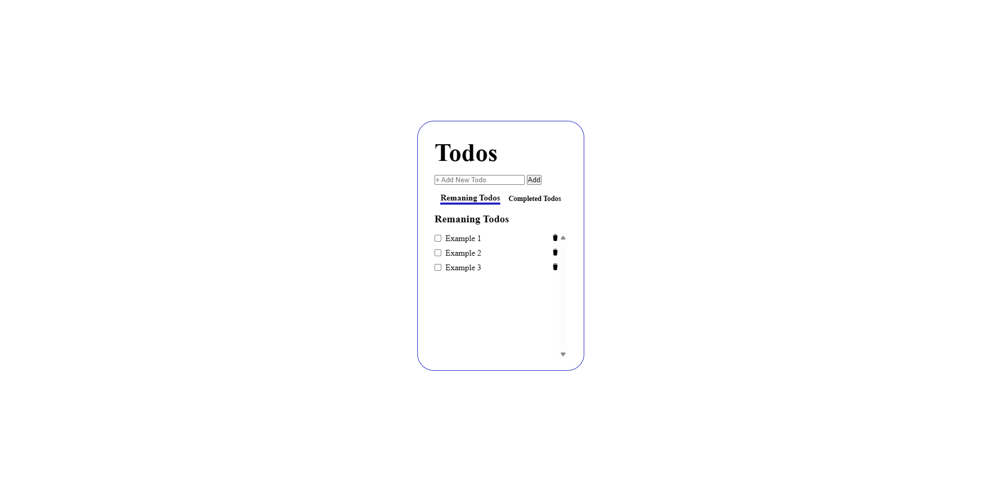

# [Todo List with HTML CSS and JS](https://todo-html-css-js.vercel.app/). Track your tasks

## 🏗 Installation

### 1. clone the repository

```sh
git clone https://github.com/rahulrajdahal/todo-html-css-js.git
```

### 2. Navigate into the directory

```sh
cd todo-html-css-js
```

### 3. Run with live server

#### OR

### Open index.html

## Preview

[](https://todo-with-html-css-js.vercel.app/)

## 🚀 Project Structure

Inside of project [Todo list with html css and js](https://todo-html-css-js.vercel.app), you'll see the following folders and files:

```text
/
├── app.js
├── index.html
├── styles.css
```
